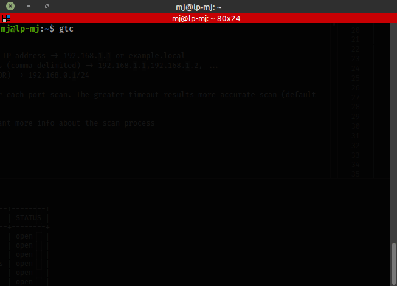

# TCP Scanner
This is an example of TCPScanner Go module. You can compile it or use owr pre-compiled executables.

in order to run **tcpscanner** you can run the following command:
```
go run /path/to/main.go -target 192.168.1.1
```



## Command line arguments
Here are the command line arguments:
```
  -maxthreads int
        Maximum number of threads: between 5 to 8192 (default 10)
  -opens
        if provided, will report only open ports not closed!
                ** If number of ports will be more than 20, will print only open ports
  -output string
        Output file
  -ports string
        Target ports to scan. If not provided, all ports will be scanned.
        Examples:
                1. Single Port -> 22
                2. Multiple Ports (comma delimited) -> 80,443,22,...
                3. Port Range -> 1-1024
  -target string
        Target to scan.
        Examples:
                1. Hostname or IP address -> 192.168.1.1 or example.local
                2. Multiple IPs (comma delimited) -> 192.168.1.1,192.168.1.2, ...
                3. IP/Mask (CIDR) -> 192.168.0.1/24
  -timeout int
        Timeout(in seconds) for each port scan. The greater timeout results more accurate scan (default 3)
  -verbose
        Use this flag if you want more info about the scan process
```